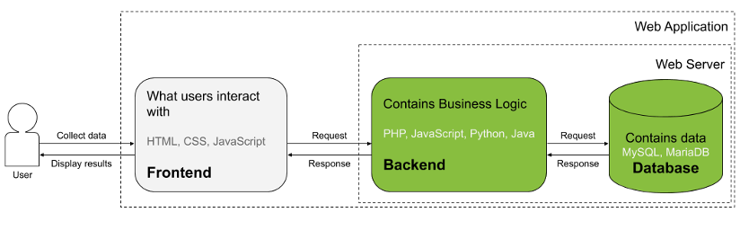
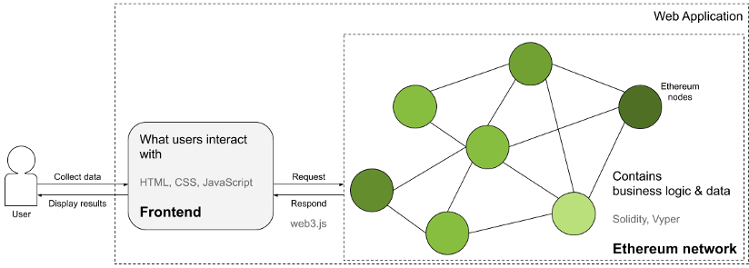

**Disclaimer: potential security vulnerabilities in project dependencies will remained unchanged.** 

# Supplier Selection DApp
Supplier Selection DApp running on Ethereum. 

# Thesis Title
Design and Development of a Smart Contract 
based on Blockchain Technology for the Supply Chain
in the Pharmaceutical Industry

# Abstract of Thesis
It is important to understand and monitor the development of new technologies that have the potential to affect the structural design and functioning of markets. In the thesis, we aim to design and develop a mechanism to facilitate peer-to-peer trade among disparate, geographically-dispersed organizations in the pharmaceutical supply chain that minimizes the need for an authoritative trusted third party and its related frictions and costs. This mechanism must be able to operate on a decentralized, distributed computing system, which is the characteristic system in most modern supply chains. The computing system we consider is Ethereum and the mechanism is Turing complete smart contracts. 

# Description
DAPP to elect mutual supplier in a Group Purchasing Organization by election. We transition from a typical web application architecture into a decentralized application architecture based on the Ethereum blockchain and smart contracts. 

Simplified diagram of web application architecture with central web server based on \[DABBS 2019; SINELNIKOVA 2017; SHKLAR et al. 2003, p. 34, 204\]

Simplified diagram of decentralized application based on the Ethereum blockchain based on \[ETHEREUM COMMUNITY 2019b; SINELNIKOVA 2017\]

# Resources
Dabbs, Mark. 2019. The Fundamentals of Web Application Architecture. \[Online\] July 2019. \[Cited: January 12, 2020.\] https://reinvently.com/blog/fundamentals-web-application-architecture/.

Ethereum Community. 2019b. web3j Docs Transactions. \[Online\] 2019. \[Cited: January 12, 2020.\] https://web3js.readthedocs.io/en/v1.2.4/. Revision 48cc9715.

Sinelnikova, Elena. 2017. Decentralized applications development for .NET developers using Microsoft Visual Studio. \[Online\] November 2017. \[Cited: January 12, 2020.\] https://blockgeeks.com/decentralized-applications-development-net-developers/.

Shklar, Leon and Rosen, Richard. 2003. Web Application Architecture: Principles, Protocols and Practices. West Sussex : John Wiley & Sons Ltd, 2003. ISBN 0-471-48656-6.

<!---
alternative way to display an image:

-->
